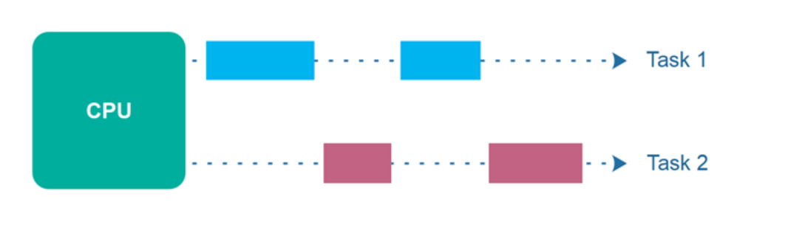
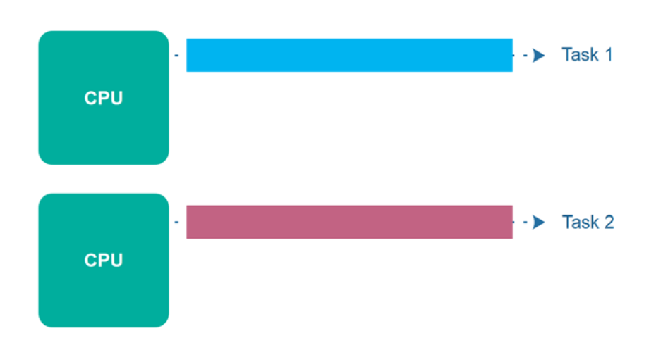
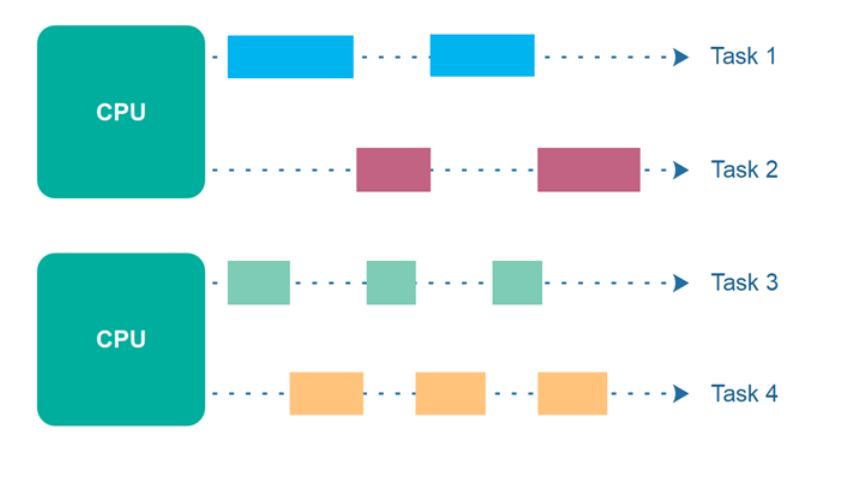

### Process(进程)

A process is a self-contained unit of execution that consists of its own memory space, program code, and system resources. Each process runs independently and does not share memory with other processes. Processes are typically isolated from each other.

### Thread(线程)

A thread is the smallest unit of execution within a process. Threads within the same process share the same memory space and resources. They can communicate and coordinate with each other more easily than processes.

### Concurrency(并发)

Concurrency means that an application is making progress on more than one task - at the same time or at least seemingly at the same time (concurrently).

If the computer only has one CPU the application may not make progress on more than one task at exactly the same time, but more than one task is in progress at a time inside the application. To make progress on more than one task concurrently the CPU switches between the different tasks during execution. This is illustrated in the diagram below:

### Parallel Execution

Parallel execution is when a computer has more than one CPU or CPU core, and makes progress on more than one task simultaneously. Parallel execution is illustrated below:

### Parallel Concurrent Execution

It is possible to have parallel concurrent execution, where threads are distributed among multiple CPUs. Thus, the threads executed on the same CPU are executed concurrently, whereas threads executed on different CPUs are executed in parallel. The diagram below illustrates parallel concurrent execution.

### Dead Lock(死锁)

产生死锁的四个必要条件:
* 互斥条件: 一个资源在某一时刻只能被一个线程占用
* 请求与保持条件: 一个线程在请求其他资源时,保持对已分配资源的占用
* 不可抢占条件: 一个资源只能被占用的线程主动释放,其他线程不能强行抢占
* 循环等待条件: 存在一个线程等待资源的循环链,链中的每个线程都在等待下一个线程占用的资源